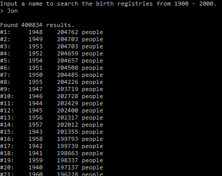

# Population-Calculator

This program generates a data set of people that were born on or after 1900 and died before the year 2000. Then, the data is sorted into censuses and ordered according to the largest population years.

The generated data set is seeded by using a numerology concept of converting the characters of the input name into integers 1-9.

